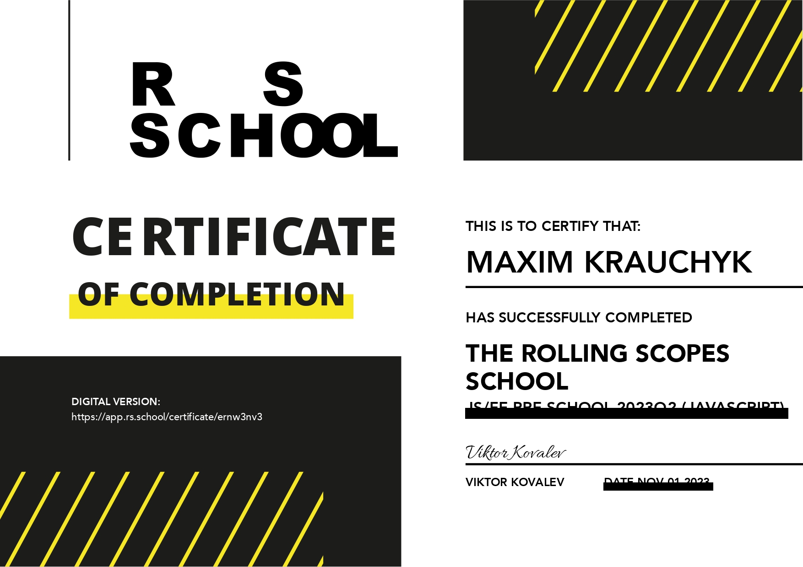

# Maxim Krauchyk

## Junior Frontend/Python Developer

***

### Contacts:

 

***

### About myself:

My name is `Max`. I am `16` years old. I am from `Grodno`. My goal is to become a developer👨‍💻 and to work in the `international IT company🏢`.

Although I have a deep passion for learning and exploring new ideas. I actively participate in various competitions where I can show my `English` and `IT` skills.

**In terms of technical skills**, I have a solid foundation in `HTML`, `CSS`,`Java` and `JavaScript`. I also have knowledge in `Python` which allows me to create various projects: `chatbots in Telegram`. I constantly use `GitHub` to save my projects. Additionally, I am proficient in utilizing `Git` _for version control_, and I am familiar with popular _development tools_ such as `VS Code`, `IntelliJ IDEA`, and `PyCharm`. Furthermore, I have experience working with _design tools_ 🎨 such as `Figma`, `Adobe Illustrator`, and `Canva`, enabling me to create visually appealing _interfaces_, _presentations_ and _beautiful slide-shows_.

Last year I started using `ChatGPT` and finding out the latest news📰 about `neural networks`. It helps me to find the necessary information when I create projects very quickly.

**With a strong drive for self-improvement and passion for programming🖥️🖱️ and neural networks🤖, I am excited to embark on this journey🚢 to achieve my goals🎯 in the IT industry💻.**

***

### Skills:

- HTML, CSS
- JavaScript Basics , Python
- Github, Git
- VS Code, InteliJ Idea, PyCharm
- Figma, Adobe Ilustrator , Canva

***

### Code Example:

    function displayAndReplacePhrase() {
        const originalPhrase = "My CV is amazing";
        let displayElement = document.getElementById("display-element");

        for (let i = 0; i < originalPhrase.length; i++) {

            setTimeout(() => {
                displayElement.innerHTML += originalPhrase[i];
            }, i * 100);
        }

        setTimeout(() => {
            displayElement.innerHTML = "";
        }, originalPhrase.length * 100);

        setTimeout(() => {
            const newPhrase = "I'm coding right now";
        for (let i = 0; i < newPhrase.length; i++) {
                setTimeout(() => {
                    displayElement.innerHTML += newPhrase[i];
                }, i * 100);
            }
        }, originalPhrase.length * 100 + 500);
    }

    displayAndReplacePhrase();

***

### Courses:

- **JavaScript Epam Kids (completed)**
  

- **Java Epam Kids (completed)**
  

- **Rolling Scopes JavaScript Stage#0 (completed)**
  

***

### Projects:

#### Telegram Bots

- [_Levelizer_](https://t.me/LevelizerBot) (English Bot)
- [_KravchenskiBot_](https://t.me/KravchenskiBot) (My personal bot with multiple functions in it.)

#### Personal Projects

- [_AudioPlayer_](https://rolling-scopes-school.github.io/kravchenski-JSFEPRESCHOOL2023Q2/audio-player)
- [_Image Gallery_](https://rolling-scopes-school.github.io/kravchenski-JSFEPRESCHOOL2023Q2/image-galery/)
- [_XX.XX.2023_](https://www.artifact.by/)

***

### Languages:
* English - `Intermediate`
* Russian, Belarusian - `Native`
* Polish - `Intermediate`